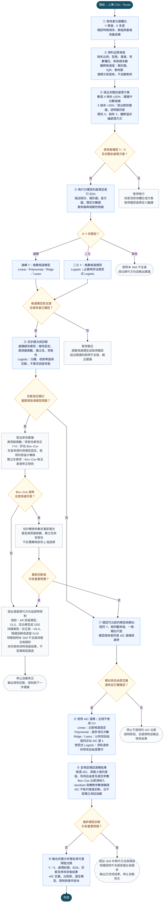

```mermaid
%%{init: {'theme': 'base', 'flowchart': {'curve': 'linear', 'nodeSpacing': 25, 'rankSpacing': 45}, 'themeVariables': {'fontSize': '16px'}}}%%
flowchart TB
 START([開始：上傳 CSV／Excel])
 START --> A["① 使用者勾選欄位<br/>Y 單選、X 多選<br/>確認時間順序、群組與重複測量結構"]
 A --> B["② 資料品質檢查<br/>缺失比例、型態、重複、常數欄位、秩與樣本數<br/>離群候選值：箱形圖、IQR、散佈圖<br/>僅標示與查核，不自動刪除"]
 B --> C["③ 提出完整前處理方案<br/>數值 X 缺失 ≤20%：建議中位數插補<br/>X 缺失 >20%：提出刪除建議，須明確同意<br/>類別 X、缺失 Y、離群值另議處理方式"]
 C --> D{"使用者確認 Y／X<br/>及完整前處理方案？"}
 D -- 是 --> E["④ 執行已確認的處理並進行 EDA<br/>描述統計、箱形圖、直方圖、類別次數圖<br/>散佈圖與相關性熱圖"]
 D -- 否 --> D0["暫停執行<br/>依意見修改欄位或方案<br/>取得確認後再從④繼續"]

 E --> F{"⑤ Y 的類型？"}
 F -- 連續 --> F1["連續 Y：推薦候選模型<br/>Linear／Polynomial／Ridge／Lasso"]
 F -- 二元 --> F2["二元 Y：推薦候選模型<br/>Logistic；必要時評估懲罰式 Logistic"]
 F -- 其他 --> F3(["說明本 Skill 不支援<br/>提出替代方向並輸出建議"])
 F1 --> G{"候選模型受支援<br/>且使用者已確認？"}
 F2 --> G
 G -- 是 --> H["⑥ 初步擬合與診斷<br/>連續線性模型：線性設定、異質變異數、獨立性、常態性<br/>Logistic：分離、收斂等適用診斷，不要求誤差常態"]
 G -- 否 --> G0["暫停擬合<br/>調整候選模型並取得確認<br/>超出範圍則說明不支援，輸出建議"]

 H --> I{"診斷是否顯示<br/>重要假設或模型問題？"}
 I -- 否 --> J["⑦ 確認可比較的模型與概似<br/>相同 Y、相同觀測值、一致概似尺度<br/>確認使用者同意 AIC 選模與調參"]
 I -- 是 --> I0["提出修改建議<br/>異質變異數／常態性異常且 Y>0：評估 Box–Cox<br/>先查核資料與模型設定，取得同意後才轉換<br/>獨立性異常：Box–Cox 無法直接修正相依"]
 I0 --> I1{"Box–Cox 適用<br/>且使用者同意？"}
 I1 -- 是 --> I2["估計轉換參數並重新擬合<br/>重查異質變異數、獨立性與常態性<br/>不反覆轉換直到 p 值達標"]
 I1 -- 否 --> I4["提出適當替代方向並說明限制<br/>相依：AR 誤差模型、GLS、混合模型或 GEE<br/>持續異質／非正態：WLS、穩健迴歸或適當 GLM<br/>明確說明本 Skill 不支援其擬合與調參<br/>未同意修改時保留結果，不宣稱假設通過"]
 I2 --> I3{"重新診斷後<br/>仍有重要問題？"}
 I3 -- 是 --> I4
 I3 -- 否 --> J
 I4 --> I5(["停止自動修正<br/>輸出現有診斷、限制與下一步建議"])

 J --> K{"概似與自由度定義<br/>適用且已獲確認？"}
 K -- 是 --> L["⑧ 使用 AIC 選模；全程不使用 CV<br/>Linear：比較候選設定<br/>Polynomial：選多項式次數<br/>Ridge／Lasso：以有效自由度的近似 AIC 選 λ<br/>懲罰式 Logistic：須有適用的有效自由度實作"]
 K -- 否 --> K0(["停止不適用的 AIC 比較<br/>說明原因、支援限制並輸出現有結果"])
 L --> M["⑨ 呈現並確認選模結果<br/>候選 AIC、與最小值的差值、有效自由度及選定參數<br/>Box–Cox 比較須納入 Jacobian 與轉換參數複雜度<br/>AIC 不取代殘差診斷，也不是獨立測試成績"]
 M --> N{"最終模型診斷<br/>仍有重要問題？"}
 N -- 否 --> O["⑩ 輸出完整分析報告與可重現程式碼<br/>Y／X、處理紀錄、EDA、診斷及修改前後結果<br/>AIC 定義、比較表、選定模型、限制與套件版本"]
 N -- 是 --> N0(["提出 Skill 外替代方法與理由<br/>明確說明不支援其擬合與調參<br/>輸出已完成結果，停止自動修正"])
 O --> END([完成])

 classDef terminal fill:#164e63,color:#ffffff,stroke:#164e63,stroke-width:3px;
 classDef main fill:#eff6ff,color:#172554,stroke:#60a5fa;
 classDef decision fill:#fffbeb,color:#78350f,stroke:#f59e0b;
 classDef note fill:#f8fafc,color:#334155,stroke:#94a3b8;
 class START,END terminal;
 class A,B,C,E,F1,F2,H,J,L,M,O main;
 class D,F,G,I,I1,I3,K,N decision;
 class D0,F3,G0,I0,I2,I4,I5,K0,N0 note;
```
